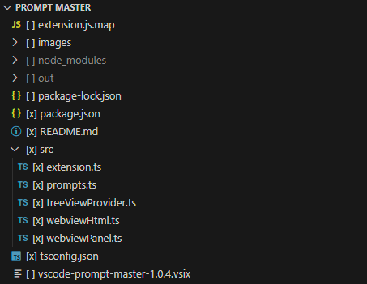

# VSCode Prompt Master

**VSCode Prompt Master** is an extension that lets you create and manage prompts for ChatGPT (or other AI models) using selected project files as context—no external app required.

## Features

- **TreeView with simulated checkboxes:** Toggle file and folder selections by clicking on items (e.g., `[x] file.txt`).
- **Multiple selection support:** Keep track of selected files and folders locally.
- **WebView Panel for prompt generation:** Combine content from selected files, custom saved prompts, and a manual prompt into one final text.
- **Direct clipboard copy:** Automatically copy the generated text to your clipboard.
- **Structured File Operations:** Apply changes (create, delete, replace) to workspace files based on structured **XML** output from an LLM.
- **Custom Prompt Management:** Save, load, and delete frequently used prompts.
- **Token Count:** Displays the token count for the generated prompt (using tiktoken `o200k_base` encoding).

## How to Use

1.  **Open a folder** in VSCode (File > Open Folder).
2.  **Locate the "Prompt Master" view** in the Explorer sidebar.
3.  **Toggle selections:** Click on any file or folder in the TreeView to toggle between `[ ]` and `[x]`. Items marked `[x]` will be included in the final prompt context.
4.  **Manage Custom Prompts:**
    - In the WebView panel (open with `Alt+2` or the command), navigate to the "Custom Prompts" section.
    - To create or update a prompt, enter a name and content, then click **Save Prompt**.
    - To delete a prompt, select it from the list and click **Delete Selected**.
    - To load multiple custom prompts for editing, hold down **Ctrl** (Windows/Linux) or **Command** (macOS) while selecting, then click **Load into Editor**. The contents will be concatenated into a single editable text area.
5.  **Generate and Copy Prompt:**
    - In the WebView, enter your manual prompt (optional).
    - Select any saved custom prompts from the list (optional).
    - Click **Generate & Copy** to combine the content of the selected files (`[x]` in the TreeView), selected custom prompts, and your manual prompt. The result is copied to your clipboard, and a token count is displayed.
6.  **Perform File Operations (Optional):**

    - In the WebView panel, locate the "File Operations from Structured Output" section.
    - Paste **XML** output from your LLM that follows the required format (click the 'i' icon in the panel for detailed instructions).
    - The XML must contain an `<operations>` root element with one or more `<operation>` children.
    - Each `<operation>` needs `action` ("create", "delete", "replace") and `path` attributes (relative to the workspace root).
    - For `create` and `replace` actions, include a `<content>` child element. It's highly recommended to wrap the file content within `<![CDATA[...]]>` to handle special characters and newlines easily.
    - Click **Process File Operations** to apply the changes to your workspace files.

    **Example XML Format:**

    ```xml
    <operations>
      <operation action="create" path="src/utils/helpers.js">
        <content><![CDATA[
    export const greet = (name) => {
      console.log(`Hello, ${name}!`);
    };
    ]]></content>
      </operation>
      <operation action="delete" path="temp/notes.txt" />
      <operation action="replace" path="config.json">
        <content><![CDATA[
    {
      "theme": "dark",
      "fontSize": 14
    }
    ]]></content>
      </operation>
    </operations>
    ```

7.  **Keyboard Shortcut:** Press `Alt+2` to open the Prompt Master panel directly without using the Command Palette.

## Screenshots

_(Note: Screenshots might not fully reflect the latest UI changes, especially regarding the XML file operations section.)_

### Prompt Master View



### Create Prompt Window


## Developing Locally

1.  Run `npm install` to install dependencies.
2.  Run `npm run compile` to compile the TypeScript files.
3.  Open the project in VSCode and press `F5` to launch a new VSCode window with the extension loaded.
4.  In the new window, open the Command Palette and search for **Prompt Master** to access the extension commands.

## Packaging and Publishing

- Run `vsce package` to generate the `.vsix` package.
- Run `vsce publish` (if you have an account) to publish the extension to the Marketplace.

## License

[MIT License](https://mit-license.org/)
